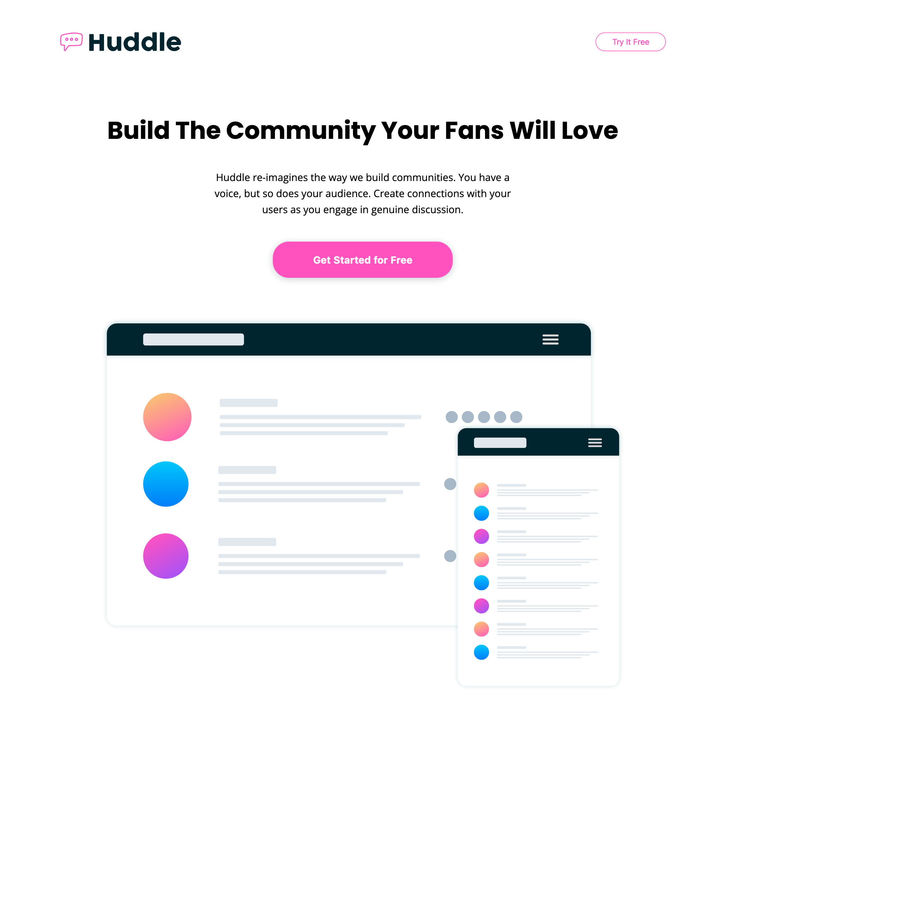

## Table of contents

- [Table of contents](#table-of-contents)
- [Overview](#overview)
  - [The challenge](#the-challenge)
  - [Screenshot](#screenshot)
  - [Links](#links)
- [My process](#my-process)
  - [Built with](#built-with)
- [Author](#author)

## Overview

### The challenge

Users should be able to:

- View the optimal layout for the site depending on their device's screen size
- See hover states for all interactive elements on the page
- BONUS: add JS for email validation

### Screenshot

### Links

- Solution URL: [Add solution URL here](https://github.com/andrewteece/huddle-landing)
- Live Site URL: [Add live site URL here](https://andrewteece.github.io/huddle-landing/)

## My process

### Built with

- Semantic HTML5 markup
- CSS custom properties
- Flexbox
- Mobile-first workflow
- JavaScript

## Author

- Website - [Add your name here](https://andrewteece.com)
- Frontend Mentor - [@yourusername](https://www.frontendmentor.io/profile/andrewteece)
- Twitter - [@yourusername](https://www.twitter.com/teece_andrew)

